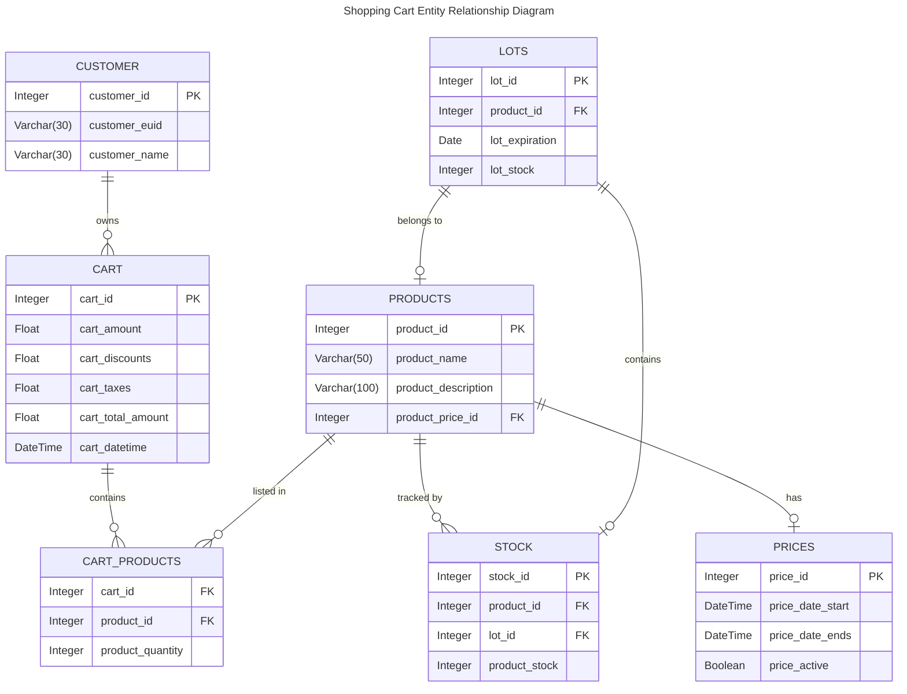

```mermaid
---
title: Shopping Cart Entity Relationship Diagram
---

erDiagram

CUSTOMER {
  Integer customer_id PK
  Varchar(30) customer_euid
  Varchar(30) customer_name
}

CART {
  Integer cart_id PK
  Float cart_amount
  Float cart_discounts
  Float cart_taxes
  Float cart_total_amount
  DateTime cart_datetime
}

PRODUCTS {
  Integer product_id PK
  Varchar(50) product_name
  Varchar(100) product_description
  Integer product_price_id FK
}

CART_PRODUCTS {
  Integer cart_id FK
  Integer product_id FK
  Integer product_quantity
}

PRICES {
  Integer price_id PK
  DateTime price_date_start
  DateTime price_date_ends
  Boolean price_active
}

STOCK {
  Integer stock_id PK
  Integer product_id FK
  Integer lot_id FK
  Integer product_stock
}

LOTS {
  Integer lot_id PK
  Integer product_id FK
  Date lot_expiration
  Integer lot_stock
}

%% Relationships
CUSTOMER ||--o{ CART : "owns"
CART ||--o{ CART_PRODUCTS : "contains"
PRODUCTS ||--o{ CART_PRODUCTS : "listed in"
PRODUCTS ||--o| PRICES : "has"
PRODUCTS ||--o{ STOCK : "tracked by"
LOTS ||--o| STOCK : "contains"
LOTS ||--o| PRODUCTS : "belongs to"


```
